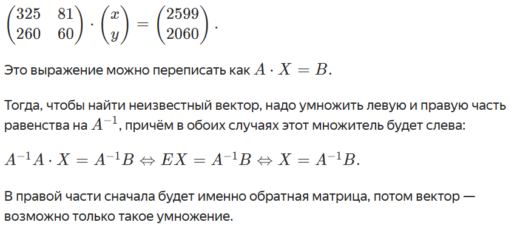

Сотрудники «Гнездовика», у которых есть собаки, решили познакомить своих питомцев и поехали вместе за город. Макс взял своего пса Тоби.
Человеческий билет на электричку стоил 325 рублей, а собачий — 81. 
Обратно ехали на автобусе: 260 рублей с человека и 60 с пса. 
На путь за город вся компания потратила 2599 рублей, обратно — 2060 рублей. 
Сколько всего людей и зверей ездили на корпоратив собачников?

Данные о стоимости билетов запишем матрицей: в одном столбце данные о человеческих билетах, во втором — о собачьих.
